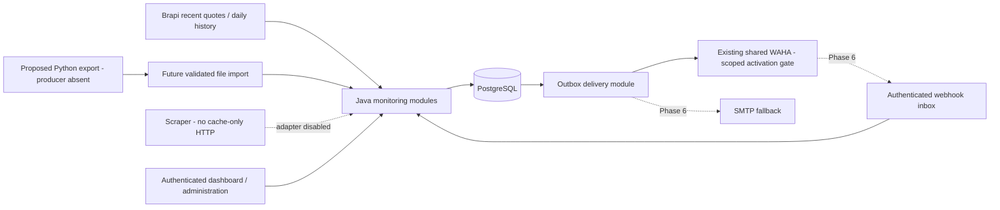

# Architecture proposal and data ownership

Status: **SOURCE-RECONCILED PROPOSAL, HUMAN APPROVAL PENDING**. Ten reports/23 CSV rows read; upstream findings are AUDIT_REPORTED. [Review packet](../planning/RECONCILIATION.md) and [ADRs](ADRS.md) record remaining gates. No runtime topology deployed.

## Runtime and independence

Propose one Spring Boot process with domain modules, one PostgreSQL database, and Compose-managed deployment. WAHA is an existing shared external messaging dependency requiring approved monitor-owned session/credentials/routes/network/rate isolation; monitor Compose does not start/stop/reset/reconfigure it; SMTP is an external mail handoff. The existing Python and scraper projects keep their own lifecycle, storage, formulas and release process. No shared database, source checkout mount, process invocation or requirement that those projects stay online.

Arrows describe proposed contracts, not verified endpoints. The monitor never requests scraper cache refresh, changes its TTL or treats scraper prices as intraday observations. Core monitoring continues when either legacy project is unavailable; stale context is labeled unavailable/old rather than causing invented values.

## Domain ownership

| Module | Owned data | Boundary |
|--------|------------|----------|
| Catalog/calendar | Stable asset identities, dated ticker mappings, classification evidence, calendar revisions | No suffix-only classification or hardcoded weekday sessions |
| Collection/quota | Collection jobs, attempt ledger, cycle reservations, provider adapter policies | One global Brapi dispatch path and one concurrent in-flight attempt |
| Market storage | Immutable quote observations, separate daily series/bar revisions | No financial-context price promotion or implicit provider concatenation |
| Technical indicators | Formula version, seed state, lineage and readiness | Only compatible eligible daily series; no Java fundamental engine |
| Financial context | Import manifests, asset-only snapshots, producer status and local assurance | Python owns formulas; scraper owns cached fundamentals |
| Rules | Typed rule revisions, evaluations, episodes/rearm state, logical alerts | No arbitrary expressions or imported-context signals in v1 |
| Messaging | Outbox intents, attempts, delivery evidence, inbox/dedup | External send is after commit; transport acceptance is distinct from delivery |
| Administration/operations | Synthetic/local admin principal, policy revisions, redacted audit/metrics | UI mutations audited; no anonymous administration |

Data belongs to its source boundary. Java owns its imported copies and validation decisions, not upstream correctness. No module writes to legacy application data. Module APIs pass immutable IDs/typed values; notification adapters cannot evaluate market rules independently.

## Proposed consistency model

PostgreSQL owns rule revision checks, state transitions and outbox insertion in a single short transaction. Quota reservation and attempt markers are durable before external dispatch. Provider/network calls occur outside long database transactions. Leases and fencing prevent a second worker from claiming active work; expired leases do not prove the external call did not execute. Recovery preserves unknown consumption and delivery outcomes.

Conceptual entities: Asset, SymbolMapping, CalendarRevision, CorporateActionEvidence, QuotaCycle, Reservation, ProviderAttempt, QuoteObservation, DailySeries, DailyBarRevision, IndicatorResult, FinancialImport, FinancialMetricSnapshot, RuleRevision, RuleState, RuleEvaluation, SignalEvent, OutboxIntent, DeliveryAttempt, InboxEvent and AuditEvent. These are design concepts, not migrations or finalized schemas.

## History direction after user clarification

Official COTAHIST remains v1 history priority in Phase 5. Python ingestion is reported existing; export is absent. Audited close contract: 245-character layout, market 010, PREULT/100, RAW, annual/schema READY, per-security PARTIAL. Start with close-only artifact; full OHLCV/units/export fidelity are not established. Brapi close and adjustedClose are distinct vendor fields; close basis remains UNKNOWN until verified, adjusted methodology incomplete. No Python adjusted dataset exists according to the audit. Keep series separate by identity/source/field/basis/method/revision/units/calendar; optional producer absence does not block the Phase 4 price monitor or another eligible daily source.

Propose selecting a single eligible series per indicator rather than stitching recent Brapi bars onto COTAHIST by date. A comparison/merge requires documented overlap checks, action semantics and an explicit reviewed mapping. If a safe merge cannot be proven, retain parallel series and suppress incompatible comparisons. Raw windows crossing unresolved corporate actions are ineligible even if all records say RAW.

## Minimal dashboard proposal

Server-rendered pages in the same Spring application are the initial candidate; no separate frontend service is needed. Views cover asset freshness/quality, daily readiness, qualified financial context, rule configuration/state, imports, quota, delivery outcomes and operational pause controls. Exact UI technology, dependency versions and layout remain a later design decision.

Phase 4 needs minimal authenticated target/recipient/pause/status and outbox evidence rather than the complete dashboard. Brapi quote→eligible manual target→atomic PostgreSQL rule/state/outbox→outbound WAHA is the first delivery. Baseline/rearm, rate/expiry, redaction, encrypted backup/restore and security review gate it. Phase 5A adds proven percentages and bounded AND/OR independently of history; Phase 5B adds SMA/RSI/EMA/volume through the same typed boundary; Phase 7A synthetic consumer and 7B separately authorized real public Python producer are distinct; context stays excluded from rules. Later surfaces rerun early operations/security controls before enablement.

## Operational boundaries

Persist UTC instants and original timestamp metadata; derive trading dates through the approved America/Sao_Paulo calendar. Version corporate-action evidence rather than constructing a Java adjustment engine. Retention may compact old payload details only after a policy proves required provenance/lineage remains reconstructable. Backup/restore must reconcile quota high-water and uncertain outbox records before restarting workers.

## Critical operational and rule gates (2026-10-06)

Both CROSSING and optional initial LEVEL share durable rule/revision/lifecycle/episode/initial-consumption and cross-revision cooldown; default UNSELECTED until approved. Bounded same-asset AND/OR requires complete eligible lineage; UNKNOWN any leaf suppresses the root. Technical formulas require pinned library/API/numerical seed compatibility and independently eligible series/units. Volatility is explicitly proposed v2, not replaced by volume.

Account-wide Brapi allocation/concurrency may be shared with ticker-scraper and needs owner evidence. Source age, polling interval and commit/source→acceptance/delivery are independent metrics;45min age+30min cadence gives no<=60min real-event guarantee. Backup/recovery owner decisions include monitor-only storage/key/retention/RPO/RTO/high-water and preserve episode tokens; never restore/reset shared WAHA. KNHY11 is individually quarantined, with explicitly approved valid subset dependencies and no full23 coverage claim. Real Python integration cannot be claimed from consumer synthetic fixtures. See CONTRACTS/ADR-012–015 for exact proposed semantics.
